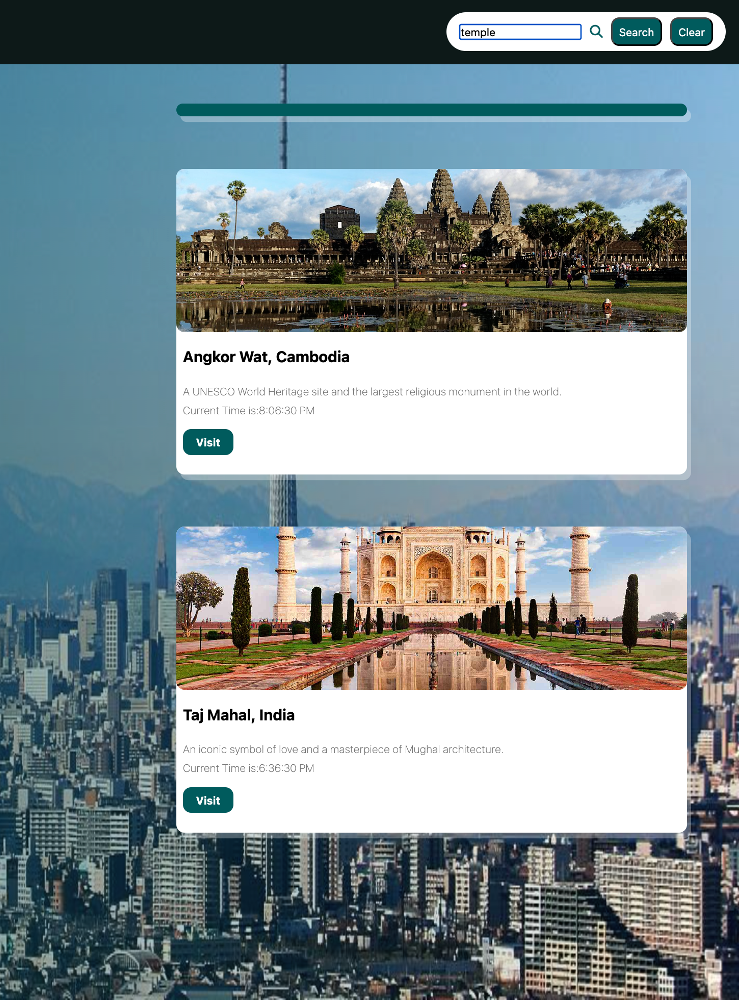
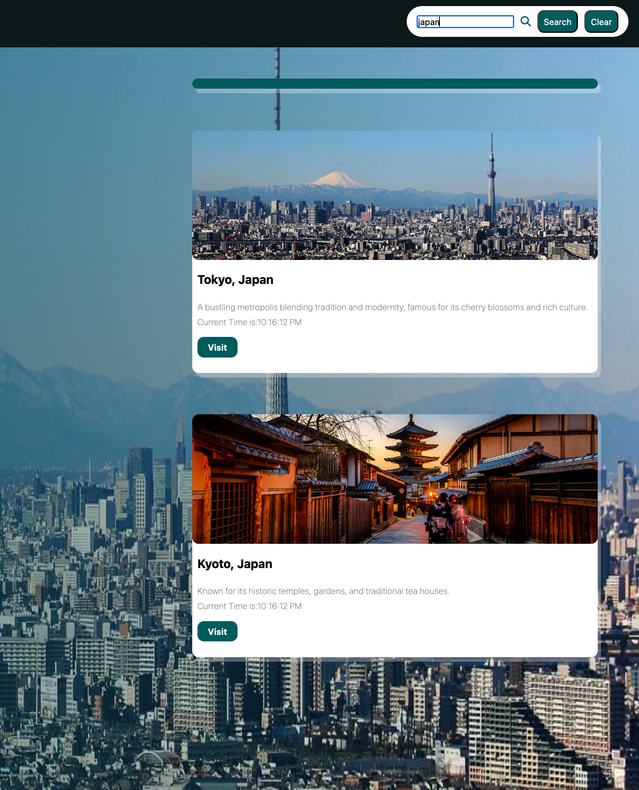
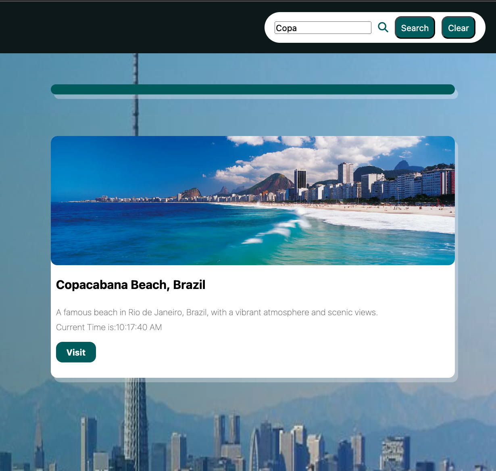

# Travel Bloom

## Introduction

This is a travel Recommendation Website created for the IBM Skills Network Course: JavaScript Essentials Final Project.

## Technologies Used
- HTML
- CSS
- JavaScript

## Tasks Done
- Task 1: HTML template
    - Create a basic HTML template structure in the travel_recommendation.html file
    - Named it as index.html
- Task 2: Navbar
    
    - Created a navbar with the following format:
        - Home page link using anchor tag `<a>` to navigate to home page
        - About us page link using anchor tag `<a>` to navigate to about us page
        - Contact Us page link using anchor tag `<a>` to navigate to contact us page
        - A search bar to allow users to enter keywords to search for recommendations
        - A Search button to execute the search after the user clicks on it
        - A Reset button to clear results.
- Task 3: Home page
    
    - A background image
    - An introduction to this website
- Task 4: About us

    - Information about the company
    - An introduction to the team members, displaying their names and their designated roles
- Task 5: Contact us

    - A form for users in case they want to reach out
    - The form should contain:
        - `<input>` boxes for name and email
        - `<textarea>` for users to write their message
        - Submit button to submit the form
- Task 6: Recommendation results
    - Searches through [travel_recommendation_api.json](./travel_recommendation_api.json)
    - Using the fetch() API from Javascript
        - Uses Promises which are Asynchronous Objects.
- Task 7: Search Through Keywords and Recommendations
    - Uses the JSON from the fetch() API and displays the following results"
        - Through country:
        
        - Through beach:
        
        - Through temple:
        
        - Through country name:
        
        - Through `any destination` name:
        